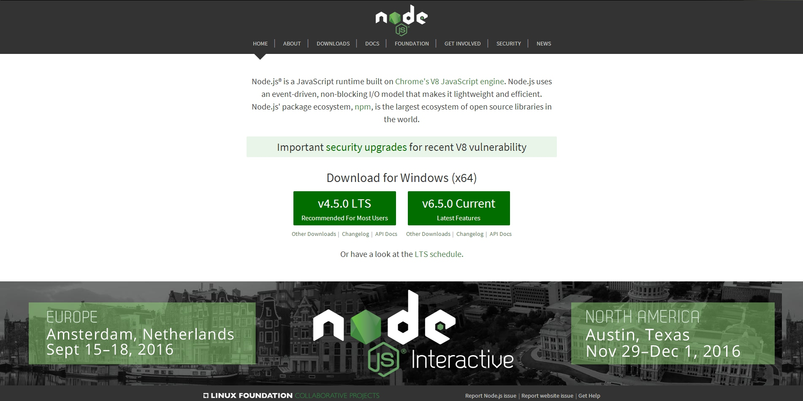
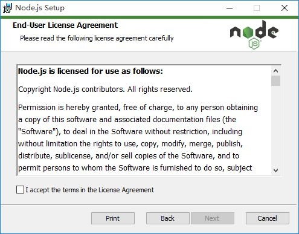
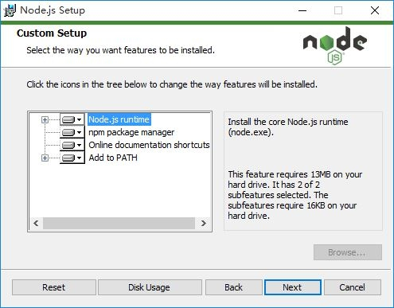
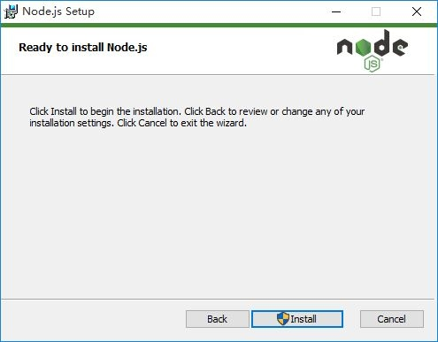
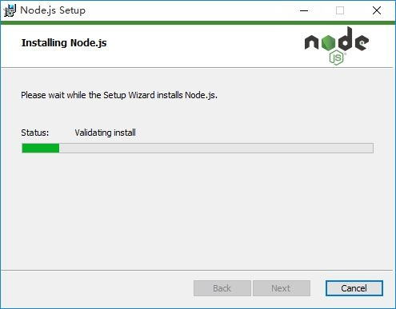
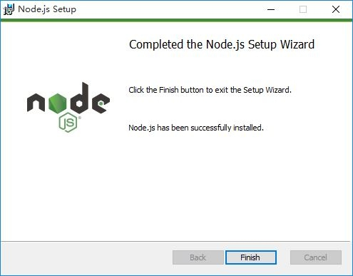

# Windows 系统环境安装 Node.js

## 第一步：访问 Node.js 的官方网站

访问 Node.js 官方网站地址：[https://nodejs.org/en/](https://nodejs.org/en/)，如下图：



Node.js 官方提供两个版本：一个是长期支持版本，一个是最新版本。**这里建议下载长期支持版本，因为这个版本更稳定。**如下图：


选择长期支持版本（点击上面的按钮），下载 Windows 系统的安装文件。如下图：


## 第二步：安装 Node.js 的环境

1、双击 Node.js 的安装文件，进入 Node.js 的安装界面。如下图：


2、点击右下角的【Next】按钮，继续安装 Node.js 环境。如下图：



如上图所示，显示的是 Node.js 官方的“软件许可协议”。

3、勾选选项 “I accept the terms in the License Agreement”，表示同意 Node.js 软件许可协议的内容。如下图：


4、点击【Next】按钮，继续安装 Node.js 环境。如下图：


如上图所示，自定义 Node.js 环境的安装路径，一般建议使用默认路径。

> 如果自定义安装路径，**需要注意的是：** 路径中不能包含中文或空格，可能引起乱码问题。

5、点击【Next】按钮，继续安装 Node.js 环境。如下图：



如上图所示，自定义安装 Node.js 环境的组件。一般建议安装所有组件，即默认安装。

6、点击【Next】按钮，继续安装 Node.js 环境。如下图：



如上图所示，询问是否确认安装 Node.js 环境。（此步骤主要是确认之前的设置）

7、点击【Install】按钮，开始自动安装 Node.js 环境。如下图：



8、等待 Node.js 环境自动安装完毕，如下图：



如上图所示，点击【Finish】按钮，结束 Node.js 环境的安装过程。

## 第三步：验证 Node.js 是否安装成功

1、运行 Windows 系统下的 “命令行” 程序，如下图：


2、在 “命令行” 程序中输入如下命令，验证 Node.js 的环境是否安装成功。

```
node -v
```

如果在 “命令行” 程序中出现如下图的提示内容，则表示 Node.js 的环境安装成功。如下图：


> **需要说明的是：** `node -v` 命令表示查看当前 Node.js 环境的版本。

## 第四步：验证 npm 包管理器是否可用

1、运行 Windows 系统下的 “命令行” 程序，如下图：


2、在 “命令行” 程序中输入如下命令，验证 npm 包管理器是否可用。

```
npm -v
```

如果在 “命令行” 程序中出现如下图的提示内容，则表示 npm 包管理器可用。如下图：


> **需要说明的是：** `npm -v` 命令表示查看当前 npm 包管理器的版本。